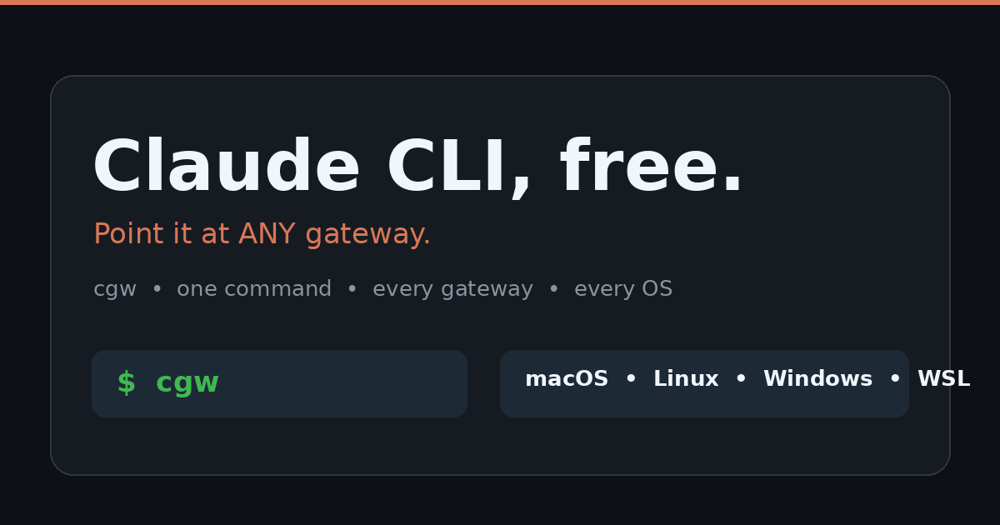
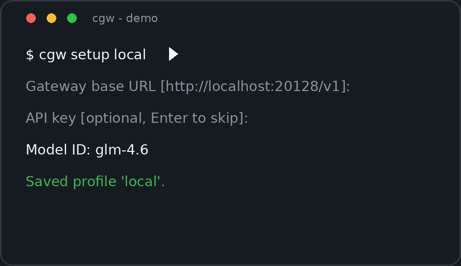
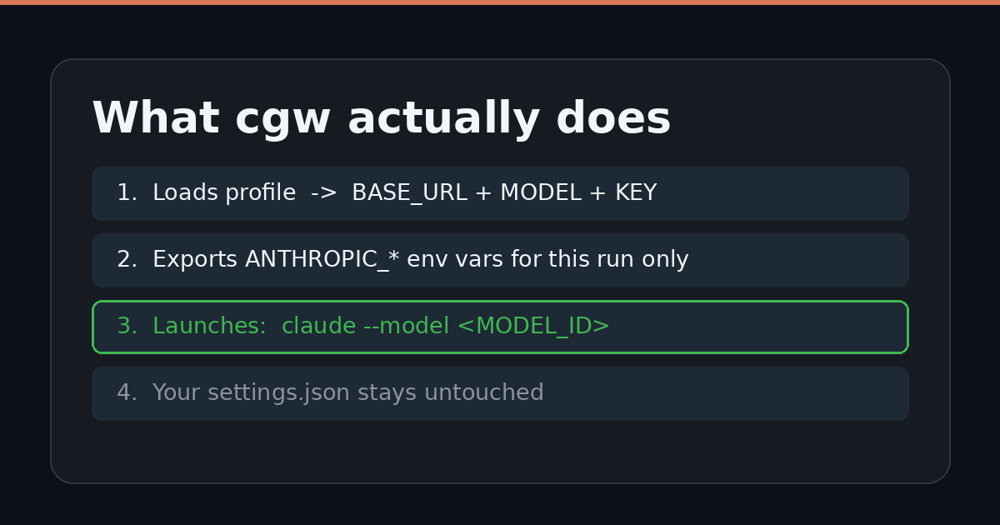
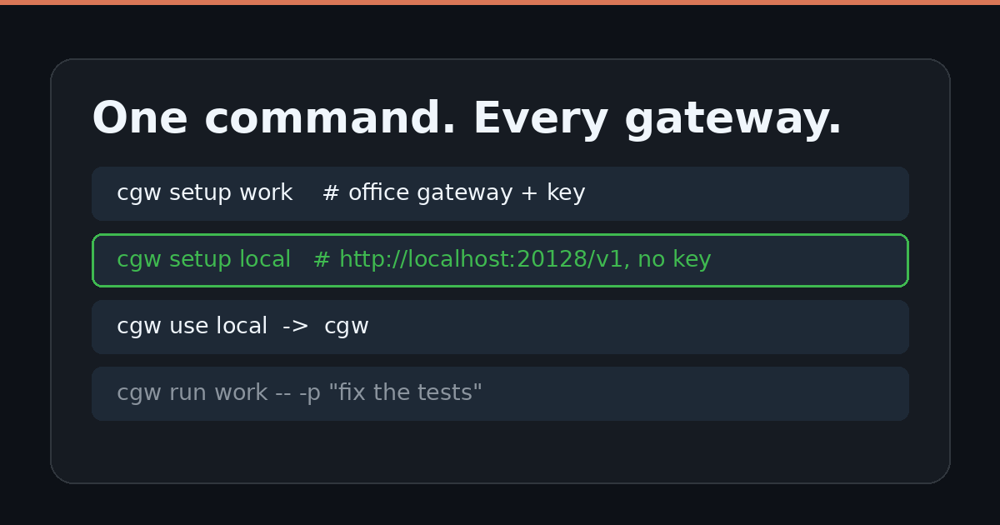

<div dir="rtl" align="center">

# کلاد CLI رایگان 🐱

### کلاد کد را با یک دستور به هر گیت‌وی سازگار با Anthropic وصل کن.



[](https://github.com/isina-nej/claude-gateway-switcher)
[](https://github.com/isina-nej/claude-gateway-switcher)
[](https://github.com/isina-nej/claude-gateway-switcher)
[](https://github.com/isina-nej/claude-gateway-switcher)
[](LICENSE)

**🇬🇧 [English version](README.md)**

`cgw` یک لانچر کوچک و پروفایل‌محور برای [Claude Code](https://code.claude.com/docs/en/setup) است.
گیت‌وی، مدل و کلید را برای هر اجرا عوض می‌کند — **بدون اینکه به `~/.claude/settings.json` دست بزند.**



</div>

<div dir="rtl">

---

## نصب در ۳۰ ثانیه ⚡

سیستم‌عاملت را انتخاب کن. همین. بقیه این فایل فقط آموزش استفاده است.

### مک 🍎 / لینوکس 🐧 / دبلیواس‌ال 🐧

```bash
git clone https://github.com/isina-nej/claude-gateway-switcher.git claude-gateway-switcher
cd claude-gateway-switcher
./install.sh
# ← یک سیم‌لینک از bin/cgw به ~/.local/bin/cgw می‌سازد (با git pull همیشه به‌روز می‌ماند)
# ← همان‌جا پیشنهاد ساخت پروفایل پیش‌فرض را می‌دهد
```

پیش‌نیاز: `bash` و نصب بودن `claude` (کلاد کد) در `PATH`. دستور `cgw models` فقط به `curl` نیاز دارد.

### ویندوز 🪟 (پاورشل یا CMD به‌صورت native — بدون WSL و بدون Git Bash)

```powershell
git clone https://github.com/isina-nej/claude-gateway-switcher.git claude-gateway-switcher
cd claude-gateway-switcher
powershell -ExecutionPolicy Bypass -File install.ps1
# ← فایل‌های cgw.ps1 و cgw.cmd را در ~/.local/bin کپی می‌کند و به PATH اضافه می‌کند
# ← همان‌جا پیشنهاد ساخت پروفایل پیش‌فرض را می‌دهد
```

پیش‌نیاز: پاورشل ۵.۱ به بالا (روی ویندوز ۱۰ و ۱۱ از قبل هست) و نصب بودن `claude` در `PATH`. بعدش `cgw` هم در پاورشل کار می‌کند هم در CMD.

---

## دقیقاً چکار می‌کند؟ 🎯



وقتی `cgw` را می‌زنی، دقیقاً سه اتفاق می‌افتد — نه بیشتر:

۱. **پروفایل فعال لود می‌شود** ← آدرس گیت‌وی + مدل + (اختیاری) کلید.
۲. **متغیرهای محیطی فقط برای همان اجرا اکسپورت می‌شوند** ← `ANTHROPIC_BASE_URL` و `ANTHROPIC_MODEL` همیشه؛ `ANTHROPIC_AUTH_TOKEN` یا `ANTHROPIC_API_KEY` فقط وقتی کلید ذخیره شده باشد. اگر discovery روشن باشد `CLAUDE_CODE_USE_GATEWAY=1` و `CLAUDE_CODE_ENABLE_GATEWAY_MODEL_DISCOVERY=1` هم اضافه می‌شود.
۳. **کلاد کد اجرا می‌شود** ← `claude --model "<MODEL_ID>"` به‌علاوه هر آرگومانی که خودت دادی.

فایل `~/.claude/settings.json` نه خوانده می‌شود، نه نوشته، نه مرج. با حذف `cgw` کلاد کد دقیقاً مثل قبلش می‌ماند.

### چرا پروفایل به‌جای ویرایش settings؟

| درد | درمان `cgw` |
|---|---|
| گیت‌وی اداره، خانه، لوکال رایگان — کپی‌پیست مداوم آدرس و کلید | `cgw setup work` و `setup home` و `setup local`، بعد فقط `cgw use local` |
| گیت‌وی لوکال بدون کلید با هدر احراز هویت خالی خفه می‌شود | بدون کلید ← بدون متغیر auth، بدون هدر auth. تمام. |
| ترس از کامیت شدن اتفاقی کلید در ریپوی دات‌فایل‌ها | پروفایل‌ها بیرون از گیت‌اند با دسترسی `600` |
| باگ‌های model-pinning در `settings.json` بین نسخه‌های کلاد | مدل هر بار صریح با `claude --model …` پاس داده می‌شود |

---

## تور ۶۰ ثانیه‌ای 🚀

```bash
# ۱. ساخت پروفایل لوکال بدون کلید (آدرس پیش‌فرض از قبل پر شده)
cgw setup local
#   Gateway base URL (e.g. http://localhost:20128/v1) [http://localhost:20128/v1]:
#   API key [optional, Enter to skip]:
#   Model ID: glm-4.6

# ۲. پروفایل دوم برای گیت‌وی اداره که کلید می‌خواهد
cgw setup work
#   Gateway base URL (e.g. http://localhost:20128/v1): https://gw.office.example
#   API key [optional, Enter to skip]: ********
#   Auth type: 1) Bearer token  2) x-api-key [1]: 1
#   Model ID: claude-opus-4-6

# ۳. سوییچ و اجرا
cgw use local
cgw                          # کلاد تعاملی روی گیت‌وی لوکال
cgw -p "explain this repo"   # غیرتعاملی، آرگومان مستقیم به کلاد می‌رسد
cgw run work -- -p "fix the tests"   # اجرای تکی روی پروفایل دیگر
```



---

## همه دستورات 📖

```bash
cgw setup [name]    # ویزارد ساخت پروفایل (نام پیش‌فرض: default)
cgw edit [name]     # اجرای مجدد ویزارد؛ Enter یعنی نگه‌دار، - یعنی پاک‌کردن کلید
cgw use <name>      # فعال‌کردن یک پروفایل
cgw list            # لیست پروفایل‌ها (* یعنی فعال)
cgw show [name]     # چاپ پروفایل با کلید ماسک‌شده
cgw models [name]   # زدن GET <BASE_URL>/v1/models برای تست اتصال و احراز هویت
cgw doctor [name]   # چک باینری claude، شکل URL، بودن کلید، دسترسی فایل، تداخل settings.json
cgw run [name] -- [args]  # اجرای یک پروفایل با آرگومان اضافه برای کلاد
cgw delete <name>   # حذف پروفایل
cgw [args...]       # آرگومان ناشناس یعنی آرگومان کلاد روی پروفایل فعال
```

میان‌برهایی که تایپ را کم می‌کنند: در setup آدرس `http://localhost:20128/v1` از قبل پر شده؛ اگر URL را با `/v1` انتهایی پیست کنی خودش strip می‌کند؛ کلید خالی یعنی `auth: none` و سؤال نوع احراز هویت کلاً پرسیده نمی‌شود.

---

## گیت‌وی بدون کلید، شهروند درجه یک 🔑

خیلی از گیت‌وی‌های لوکال اصلاً کلید نمی‌خواهند. `cgw` این را حالت عادی می‌داند، نه خطا:

- `cgw show` چاپ می‌کند `API key: (not set)` و `cgw doctor` می‌گوید `[..] No API key set (connecting without auth)`.
- موقع اجرا **هیچ** متغیر `ANTHROPIC_AUTH_TOKEN` یا `ANTHROPIC_API_KEY` اکسپورت نمی‌شود و `cgw models` **هیچ** هدر احرازی نمی‌فرستد.
- با `cgw edit` و وارد کردن `-` می‌توانی کلید ذخیره‌شده قبلی را پاک کنی.

---

## پروفایل‌ها کجا ذخیره می‌شوند؟ 💾

```text
~/.config/claude-gateway-switcher/profiles/*.conf      # مک / لینوکس / WSL
%APPDATA%\claude-gateway-switcher\profiles\*.conf      # ویندوز
```

- روی یونیکس: فایل‌ها `600` و دایرکتوری‌ها `700`. کلید هیچ‌وقت وارد این ریپو نمی‌شود (`.gitignore` جلوی `*.conf` را گرفته).
- روی ویندوز اول `$env:XDG_CONFIG_HOME`، بعد `%APPDATA%`، بعد `$HOME\.config`.
- فرمت `.conf` در هر دو سمت یکی است: پاورشل فایل LF بدون BOM با استایل سینگل‌کووت می‌نویسد که bash مستقیم source می‌کند؛ bash هم CRLF را تحمل می‌کند اگر فایل را دستی روی ویندوز ویرایش کنی؛ همه املاهای `%q` در bash (ساده، `'...'`، `$'...'`، `"..."`) در پاورشل خوانده می‌شوند. پروفایل را بین سیستم‌عامل‌ها کپی کن، کار می‌کند.

---

## نیازمندی گیت‌وی 🌐

هر گیت‌ویی که Messages API مورداستفاده کلاد کد را حرف بزند. چک discovery به این اندپوینت می‌زند:

```text
GET <BASE_URL>/v1/models
```

هر وقت خواستی با `cgw models` تستش کن. هدر احراز هویت فقط وقتی اضافه می‌شود که کلید ذخیره شده باشد.

---

## نکات امنیتی 🔒

- کلید را هیچ‌وقت کامیت نکن — پروفایل‌ها از اول بیرون از ریپو طراحی شده‌اند.
- برای گیت‌وی ریموت `https://` بگذار؛ `http://localhost:*` برای لوکال ایرادی ندارد.
- `cgw models` فقط وقتی به گیت‌وی وصل می‌شود که خودت صریح اجرایش کنی.
- اپراتور گیت‌وی را قابل اعتماد بدان: پرامپت و کدی که می‌فرستی ممکن است برای آن سرویس قابل مشاهده باشد.

---

## حذف 🧹

```bash
./uninstall.sh                                            # مک / لینوکس / WSL
powershell -ExecutionPolicy Bypass -File uninstall.ps1    # ویندوز
```

دستور را حذف می‌کند و پروفایل‌ها را عمداً نگه می‌دارد. برای پاک‌کردن کر دنشیال هم دایرکتوری کانفیگ را دستی حذف کن (`~/.config/claude-gateway-switcher/` یا `%APPDATA%\claude-gateway-switcher\`).

---

<div align="center">

**اگر `cgw` تو را از جهنم settings.json نجات داد، به ریپو ⭐ بده.**

`cgw setup local` بعد `cgw` — کلاد CLI رایگان. همین.

</div>

</div>
